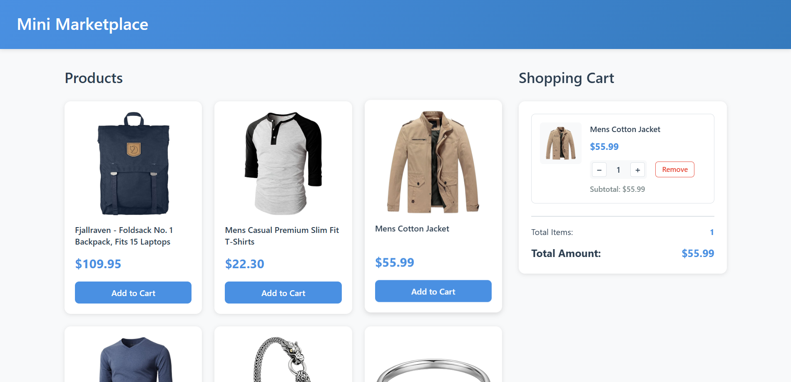
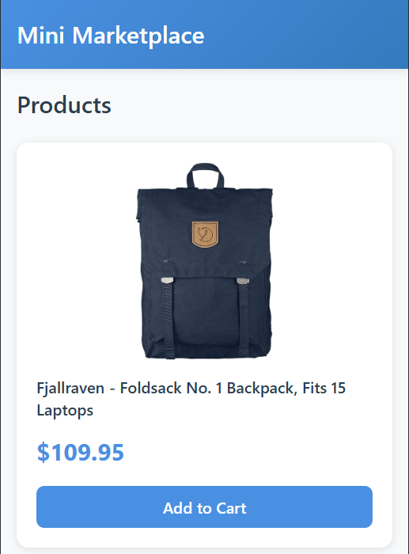
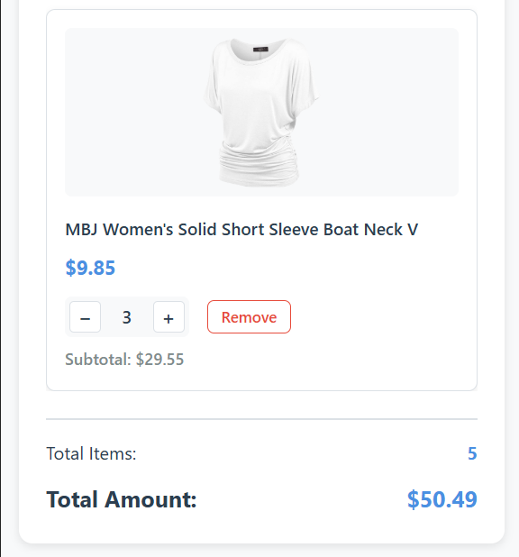

# Mini Marketplace

A Single Page Application (SPA) that allows users to browse products and manage a shopping cart.

# Author Information

**Name:** Umidjon Tojiboyev

**Time Taken:** 1 hour

**Difficult Parts:**
- Coordinating communication between vanilla JS and React using custom events
- Managing responsive design without CSS frameworks
- Ensuring cart persistence across page reloads

**Interface Screenshots:**

### Desktop View

### Mobile View

**Demo Link:**
[https://mini-marketplace.tojiboyevumidjon.uz](https://mini-marketplace.tojiboyevumidjon.uz)
